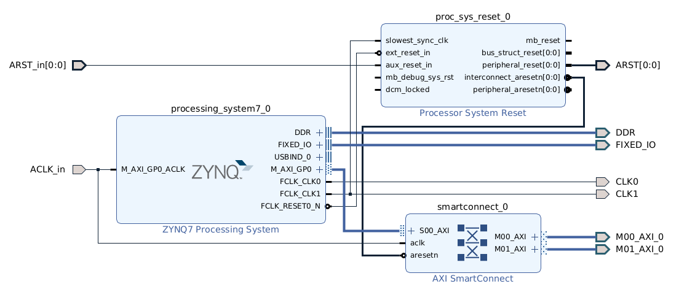

# Zynq Tools

Makefile based tools for building and debugging Zynq SoCs using vivado & xsct

Example project and Makefile in `example_proj/`

## Usage
```
cd example_proj
make fpga       # synthesize, place and route, write bitfile
make target     # build baremetal software and FSBL
make program    # program bitfile
make run        # load FSBL and run PS software
```
## Configuration

An [example project](example_proj) is provided as a template with basic usage. Your project should include a Makefile that defines the source and configuration files, and includes `vivado.mk` and `zynq.mk`, e.g.

```makefile
# design
PROJECT=my_zynq_project
FPGA_TOP = zynq_top

# project base dir
ROOT = $(abspath $(dir $(firstword $(MAKEFILE_LIST))))
# build dir
BUILD = $(ROOT)/build
# ZYNQ_TOOLS base dir
ZYNQ_TOOLS = $(abspath $(ROOT)/../)

# board 
DEVICE_LONG = xc7z020clg400-1
DEVICE_SHORT = xc7z020

# tools
HW_SERVER = 127.0.0.1:3121
TTY_DEV = /dev/ttyUSB0

# configure ila debug
ILA_DEBUG = 1 #set to nonzero to insert ila

# RTL sources
RTL_FILES = $(ROOT)/rtl/axil_regs.sv
RTL_FILES += $(ROOT)/rtl/top.sv

# constraints
XDC_FILES = $(ZYNQ_TOOLS)/boards/artyz7.xdc
XDC_FILES += $(ROOT)/clocks.xdc

# TCL sources (eg. PS with AXI)
TCL_FILES = $(ZYNQ_TOOLS)/zynq_ps.tcl

# TCL project-specific config
CONFIG_TCL_FILES = $(ROOT)/config.tcl          

# PS software
PS_SOURCE = $(ROOT)/ps_src/main.c

include $(ZYNQ_TOOLS)/vivado.mk
include $(ZYNQ_TOOLS)/zynq.mk
```

The AXI bus and ILA can be configured in a `config.tcl` file, e.g.
```tcl
# number and address map of AXIL ports
set NUM_AXIL_M 2
set AXIL_ADDR_MAP {
    {0x40000000 0x02000000}
    {0x42000000 0x02000000}
}

# ila config
set ila_clk clk_fpga_1
set ila_depth 1024
```


## Architecture

A default block-design is provided that instantiates the following:
- PS7 processor system
- Two PS->PL clocks with configurable frequency (defaults to 100MHz and 50MHz)
- AXI-Lite interconnect with configurable number of masters and address space
- Optional ILA



The PS can be instantiated in your design with the following verilog template:

```verilog
    zynq_ps_axi u_zynq
    (
        .ACLK_in          (ACLK),       // AXI bus clock
        .ARST             (ARST),       // AXI reset
        .ARST_in          (btn_rst),    // trigger reset from PL
        .CLK0             (),           // 100 MHz -- unused
        .CLK1             (ACLK),       // 50 MHz  -- main PL clock

        // connect to external I/O
        .DDR_addr         (DDR_addr),   
        .DDR_ba           (DDR_ba),
        .DDR_cas_n        (DDR_cas_n),
        .DDR_ck_n         (DDR_ck_n),
        .DDR_ck_p         (DDR_ck_p),
        .DDR_cke          (DDR_cke),
        .DDR_cs_n         (DDR_cs_n),
        .DDR_dm           (DDR_dm),
        .DDR_dq           (DDR_dq),
        .DDR_dqs_n        (DDR_dqs_n),
        .DDR_dqs_p        (DDR_dqs_p),
        .DDR_odt          (DDR_odt),
        .DDR_ras_n        (DDR_ras_n),
        .DDR_reset_n      (DDR_reset_n),
        .DDR_we_n         (DDR_we_n),
        .FIXED_IO_ddr_vrn (FIXED_IO_ddr_vrn),
        .FIXED_IO_ddr_vrp (FIXED_IO_ddr_vrp),
        .FIXED_IO_mio     (FIXED_IO_mio),
        .FIXED_IO_ps_clk  (FIXED_IO_ps_clk),
        .FIXED_IO_ps_porb (FIXED_IO_ps_porb),
        .FIXED_IO_ps_srstb(FIXED_IO_ps_srstb),

        // AXI-lite bus
        .M00_AXI_0_araddr (axil_araddr),
        .M00_AXI_0_arprot (),
        .M00_AXI_0_arready(axil_arready),
        .M00_AXI_0_arvalid(axil_arvalid),
        .M00_AXI_0_awaddr (axil_awaddr),
        .M00_AXI_0_awprot (),
        .M00_AXI_0_awready(axil_awready),
        .M00_AXI_0_awvalid(axil_awvalid),
        .M00_AXI_0_bready (axil_bready),
        .M00_AXI_0_bresp  (axil_bresp),
        .M00_AXI_0_bvalid (axil_bvalid),
        .M00_AXI_0_rdata  (axil_rdata),
        .M00_AXI_0_rready (axil_rready),
        .M00_AXI_0_rresp  (axil_rresp),
        .M00_AXI_0_rvalid (axil_rvalid),
        .M00_AXI_0_wdata  (axil_wdata),
        .M00_AXI_0_wready (axil_wready),
        .M00_AXI_0_wstrb  (axil_wstrb),
        .M00_AXI_0_wvalid (axil_wvalid),

        // additional AXI masters....
        // .M01_AXI_0_xxxx (m01_xxxx),
        // ...
    );
```

